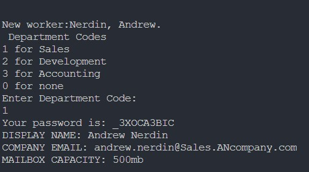

# Overview
An Email Administration Application. It should generate a new email 
based on the employee’s first name, last name, and department, 
generate a random string for their password, have set methods to 
change the password and have get methods to display name, email, 
and mailbox capacity.

# Devlopment Environment

* Java
* Visual Studio Code

# Execution
To run the program: F5

# Useful Websites

* [Java Reference](https://docs.oracle.com/en/java/javase/index.html)
* [W3Schools Java](https://www.w3schools.com/java/default.asp)