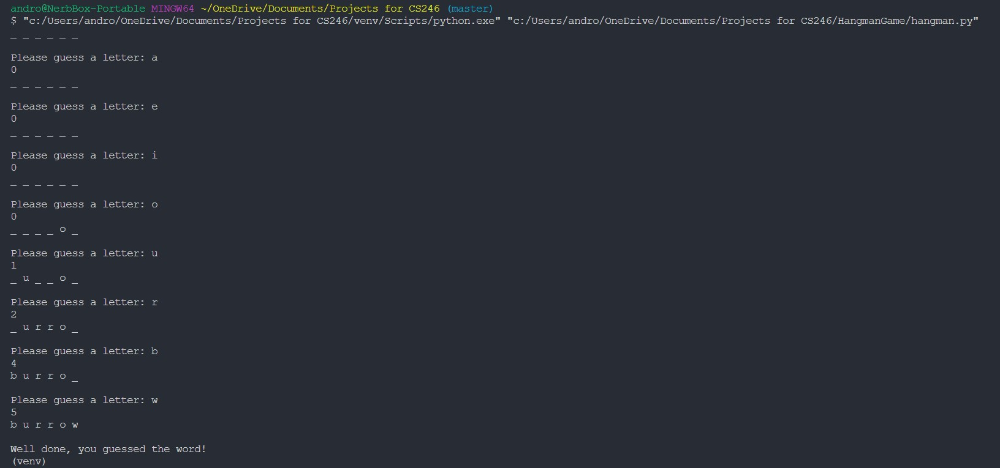

# Overview
Play a game of hang man with a predetermined word bank that randomly chooses a word from the word bank

# Devlopment Environment

* Python 3.8.5
* VIsual Studio Code

# Execution

To run the program: `python hangman.py`

# Useful Websites

* [Python Reference](https://docs.python.org/3.8/library/index.html)
* [W3Schools Python](https://www.w3schools.com/python/default.asp)