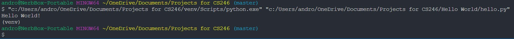

# Overview

this program says hello to the World. Demonstrates the use of Python with Visual Studio Code and Github.

# Devlopment Environment

* Python 3.8.5
* VIsual Studio Code

# Execution

To run the program: `python hello.py`

# Useful Websites

* [Python Reference](https://docs.python.org/3.8/library/index.html)
