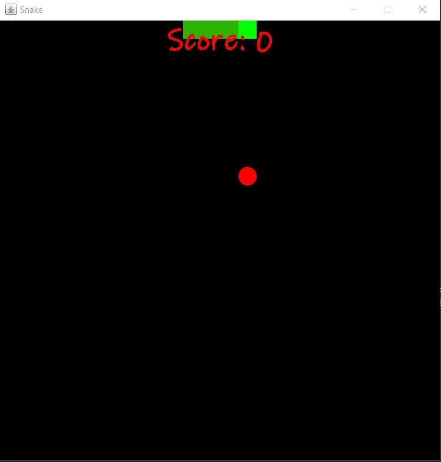
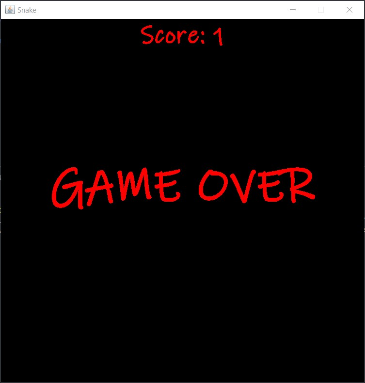

# Overview
Play the game Snake
win by collecting dots and not 
touching the walls or yourself.
How long can you last?

# Devlopment Environment

* Java
* Visual Studio Code

# Execution
To run the program: F5

# Useful Websites

* [Java Reference](https://docs.oracle.com/en/java/javase/index.html)
* [W3Schools Java](https://www.w3schools.com/java/default.asp)